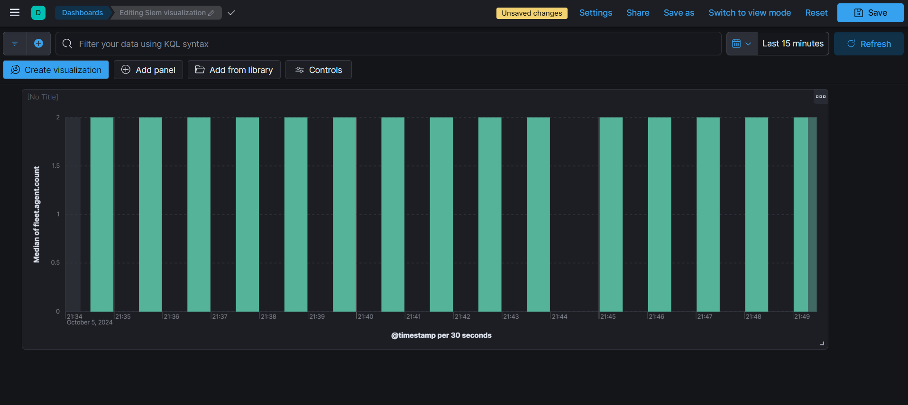

<h1>SIEM Tool Home Lab</h1>


<h2>Description</h2>
In this lab we are going to be setting up a home lab using Elastic SIEM and a Kali VM. We will forward data from the Kali VM to the SIEM using the Elastic Beats agent, generate security events on the Kali VM using Nmap, and query and analyze the logs in the SIEM using the Elastic web interface. We'll also create a dashboard to visualize security events and then create an alert to detect security events.<br />


<h2>Languages and Utilities Used</h2>

- <b>Kali Linux</b> 
- <b>Oracle Virtual Box</b>

<h2>Environments Used </h2>

- <b>Elastic Cloud</b>

<h2>Takeaways</h2>

- <b>ELASTIC STACK SIEM CONFIGURATION AND MANAGEMENT</b>: SUCCESSFULLY SET UP AND CONFIGURED ELASTIC STACK SIEM IN A HOME LAB ENVIRONMENT. DEMONSTRATED PROFICIENCY IN DEPLOYING A KALI LINUX VM, CONFIGURING ELASTIC AGENTS FOR LOG COLLECTION, AND FORWARDING DATA TO THE SIEM FOR EFFECTIVE SECURITY EVENT MONITORING.

- <b>SECURITY EVENT SIMULATION AND ANALYSIS</b>: ACQUIRED HANDS-ON EXPERIENCE IN GENERATING AND ANALYZING SECURITY EVENTS USING NMAP ON KALI LINUX. PROFICIENT IN QUERYING ELASTIC SIEM TO IDENTIFY AND INVESTIGATE SECURITY INCIDENTS, ENHANCING SKILLS IN NETWORK SECURITY MONITORING AND THREAT DETECTION.

- <b>VISUALIZATION AND ALERTING IN SIEM</b>: DEVELOPED A CUSTOM DASHBOARD IN ELASTIC SIEM TO VISUALIZE SECURITY EVENIS, DEMONSTRATING SKILLS IN DATA INTERPRETATION AND PATTERN RECOGNITION. SUCCESSFULLY CREATED AND TESTED ALERT RULES FOR DETECTING SPECIFIC SECURITY EVENTS, SHOWING COMPETENCY IN PROACTIVE INCIDENT RESPONSE AND ALERT MANAGEMENT.


<h2>Program walk-through:</h2>

<p align="center">
Connecting to the Elastic Beats agent in order to receive data from Kali VM: <br/>

<br />
<br />
Generating security events using nmap for the SIEM to pick up on:  <br/>

<br />
<br />
Log analysis: <br/>

<br />
<br />
Custom query for nmap:  <br/>

<br />
<br />
Dashboard containing security events:  <br/>

<br />
<br />
Alert to detect security events via email:  <br/>

<br />
<br />
</p>

<!--
 ```diff
- text in red
+ text in green
! text in orange
# text in gray
@@ text in purple (and bold)@@
```
--!>
